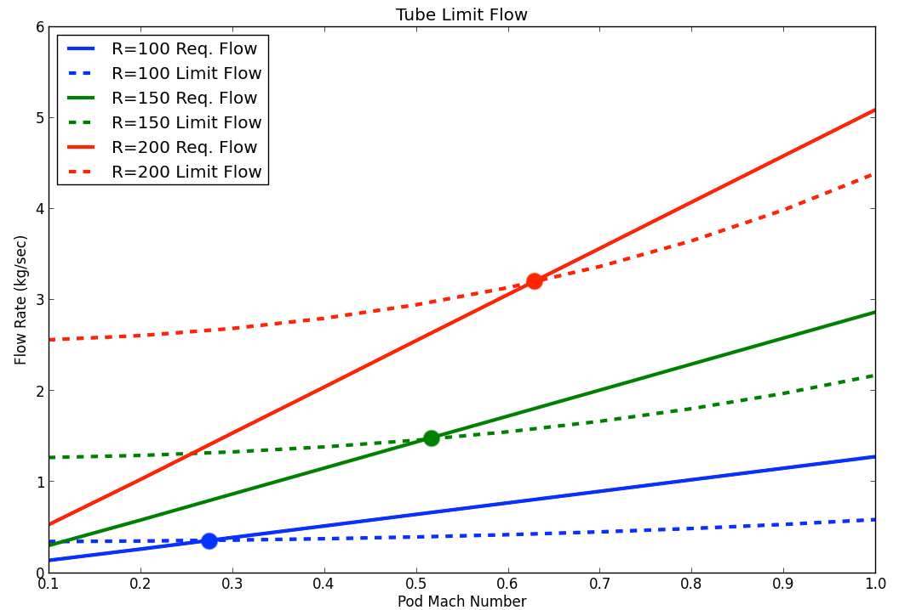
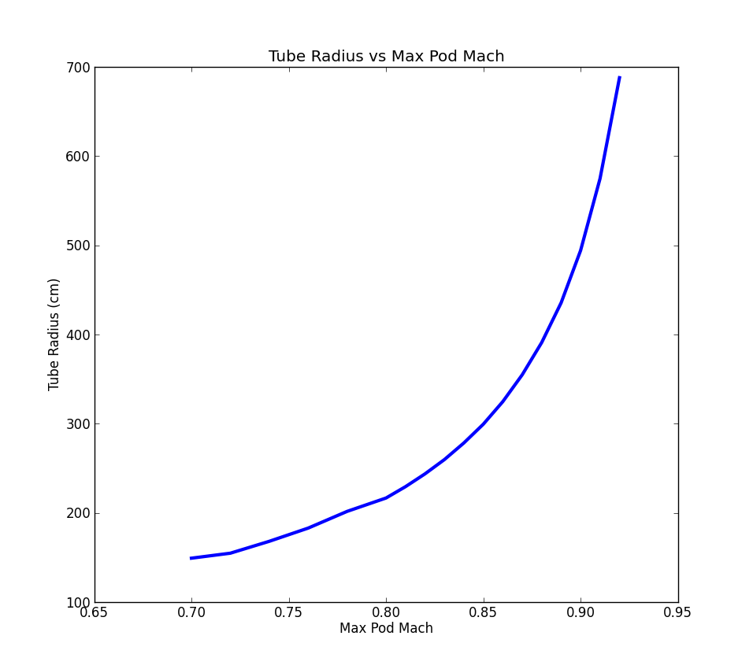

======================
Baseline Design
======================

The modeling done identifies a number of high level trends and provides some concrete 
baseline numbers for the hyperloop concept. For the most part, the ideas and numbers given
in the original hyperloop proposal hold up using this analysis. However, the data shows that
there are two major changes to the design that need to be considered. 

    #. The tube will need to be significantly larger than the original proposal. In the 
       original proposal, the tube was sized with a diameter 2.23 meters. However, it 
       appears that it will need to have a diameter closer to 4 meters. 

    #. On-board water based intercoolers are impractical due to volume and weight constraints.
       This may prove to be a non-issue since temperature rise due to compression is less 
       significant than originally estimated and only leads to a modest rise in steady-state 
       tube temperature. Assuming the tube was left uncovered, the heat rate from solar radiation 
       would be an order of magnitude larger than the heat rate added from pod compression systems. 
       Further assuming a 90 degF day, radiation and convection out of the tube would lead to a 
       manageable steady state tube wall temperature of 120 degF.

Tube Diameter
----------------------
The hyperloop pod travels through a fixed diameter tube. As it travels, 
it must displace air around itself. The displaced air moves past the 
pod with a relative velocity equal to the travel speed of the pod and 
must fit into the area between the pod and the tube wall. If you assume 
a circular cross section for the pod, then the area for the air to 
travel through is given by 

.. math:: A_{bypass} = \pi(r_{tube}^2-r_{pod}^2)

Given the conditions in the tube, we know the density of air to be 
0.00118 :math:`\frac{kg}{m^3}`. The mass flow rate of the air 
bypassing the pod is then given by

.. math:: \dot{W}_{bypass} = \rho_{air} A_{tube} V_{pod}

Since :math:`\rho_{air}` and :math:`A_{tube}` are both constant for given tube size 
and pressure, mass flow rate grows linearly with the velocity of the pod. 

For any given flow there is a physical limitation to how the amount of 
flow you can pass through a given area. The maximum flow rate occurs when 
the velocity reaches Mach 1. For the hyperloop concept, all the air must fit 
through the area between the pod and the tube, called :math:`A_{bypass}`. When 
the air going through :math:`A_{bypass}` reaches Mach 1, no additional flow can pass through. 

.. math:: \dot{W}_{limit} = \rho_{air} A_{bypass} V_{Mach 1} 

If the required  :math:`\dot{W}_{bypass}` exceeds :math:`\dot{W}_{limit}`, then the pod will 
act like a piston in a tube and start the increase the air pressure in front 
of it and lower the pressure behind it. For the baseline hyperloop design, 
the limit speed is around 120 :math:`\frac{m}{s}`, or Mach .3, as shown in the 
figure below in the blue lines. The limit is reached when the required tube mass flow equals 
the kantrowitz limit flow. The value of this limit speed is strongly dependent on the 
ratio of the pod diameter to the tube diameter. 

    Hyperloop speed limits as a function of tube radius

Such low speeds would not allow the hyperloop concept to significantly reduce 
travel times between Los Angeles and San Francisco. To reach higher speeds, 
a compression system is needed to help push additional air around the pod 
to enable higher travel speeds. The amount of air that the compression system needs 
to move is equal to the difference between the required tube flow (the solid lines) 
and the limit (the dashed lines). As speed increases, the flow demands on the 
compression system increase as well. 

The challenge is that when you increase the flow demands on the compression system, you 
also force the pod diameter to grow in order to handle the increased flow. So traveling 
faster means that the mass flow requirements grow, which drives the pod diameter up, which 
further increase the mass flow requirements. The only way to damp out this cycle is to allow
the tube diameter to grow as you increase the maximum velocity. The model set up here converges 
on the minimal possible tube diameter, given a desired pod Mach number. 

The data shows that above Mach .85, the minimum allowable tube size gets very sensitive to 
pod travel speed. This indicates that Mach numbers much higher than about .9 are likely not 
feasible. Even at a Mach .8, the tube diameter still needs to be around 4 meters. This is twice
the size considered in the original proposal. At Mach .8 the travel time is around 45 minutes. 
Although this performance is less than described in the original proposal, it still represents 
an improvement over what can be achieved with a high speed rail. 

.. _`Cooling`:

Capsule Cooling Requirements
------------------------------

The limits and requirements of a hypothtical on-board heat exchanger can be estimated with a straightforward energy balance. 
The effectiveness of a heat exchanger can be described as the ratio of actual heat transfer over the maximum 
possible heat transfer. This can be written mathematically as,

.. math::   {Q}_{released}  = effectiveness * {Q}_{max}

where :math:`{Q}_{max} = (T_{hot,in} - T_{cold,in}) {\big[ \dot{m}_{fluid} C_{p,fluid} \big]}_{lowest}` with whichever fluid has the lowest product of :math:`\dot{m}_{fluid}  C_{p,fluid}`

In order to satisfy the energy balance :math:`{Q}_{released}  = {Q}_{absorbed}` , the following must be true,

.. math::      \dot{m}_{air} C_{p, air} (T_{out, air} - T_{in, air}) = {Q}_{released} = {Q}_{absorbed}= \dot{m}_{water} C_{p,water} (T_{out, water} - T_{in, water})

where the :math:`T_{out}` of each fluid is unknown. With assumed massflow rates and initial temperatures, a valid combination of :math:`T_{out}`'s of each fluid can be found through solver iteration. Valid effectiveness levels for heat exchangers can be determined based on the E- `NTU method.`__. 

.. __: http://en.wikipedia.org/wiki/NTU_method

The effectiveness for a counter flow heat exchanger with a Cmin/Cmax of ~0.25 was chosen

.. figure:: images/heat_effectiveness.png
   :align: center
   :alt: Heat Exchanger Effictiveness Graph
   
Image from http://www.cheresources.com/content/articles/heat-transfer/heat-exchanger-effectiveness

The following conditions satisfied an energy balance with an assumed effectiveness of 0.9765, and the proposed requirement to 
cool the air completely down to inlet temperatures.

============== =============== ================= ================= ================== ========= ========= 
Fluid               Cp         :math:`{T}_{in}`  :math:`{T}_{out}` :math:`\dot{m}`     Q  kJ/s   Q  max
============== =============== ================= ================= ================== ========= ========= 
Air            1.006 kJ/kg-K        791 K             300 K            0.49 kg/s        -242      247.9
-------------- --------------- ----------------- ----------------- ------------------ --------- --------- 
Water           4.186 kJ/kg-K       288.15 K          416.6 K           0.45 kg/s         242      247.9
============== =============== ================= ================= ================== ========= =========  

With a 35 minute trip, :math:`0.45 kg/s * 60 s/min * 35 min =  945 kg` of standard temperature/pressure water would 
need to be carried with appropriate sized steam tanks. This doesn't even account for the second stage heat exchanger, 
making the system nearly infeasible with water and unpressurized tanks. Various systems involving alternate coolants 
such as liquid air or pressurized tanks could be explored.

Further discussion of heat exchanger sizing and tube equilibrium temperature can be found in the 
:ref:`Tube Temperature <TubeTemp>` section of the 'Subsystem Modeling Theory' chapter of the docs.

Sensitivity
--------------

.. figure:: images/mach_vs_energy.png
    :align: center
    :width: 800 px
    :alt: mach versus battery energy graph

    Hyperloop speed limits as a function of tube radius

