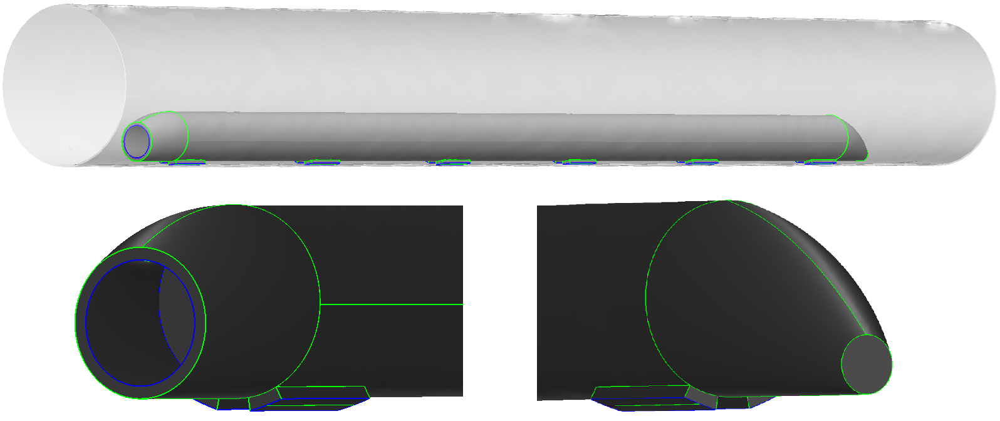

=======================
Hyperloop Documentation
=======================

Contents:

.. toctree::
   :maxdepth: 1
    
   intro
   io
   usage
   future
   contribute
   modeling
   srcdocs
   pkgdocs

The hyperloop github repository and installation instructions can be found here: `https://github.com/JustinSGray/Hyperloop`__.

.. __: https://github.com/JustinSGray/Hyperloop

The original hyperloop proposal can be found here: `Hyperloop-Alpha`__.

.. __: http://www.spacex.com/hyperloop

.. figure:: images/hyperloop.png
   :align: center
   :alt: hyperloop re-designed inlet

   Redesign of the notional inlet and nozzle using OpenCSM, a parametric solid modeler. The relational 
   size between the capsule and tube corresponds to a designed capsule speed of Mach 0.8 and bypass air 
   speed of Mach 0.95