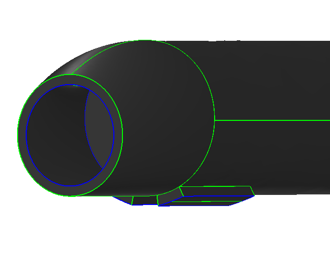
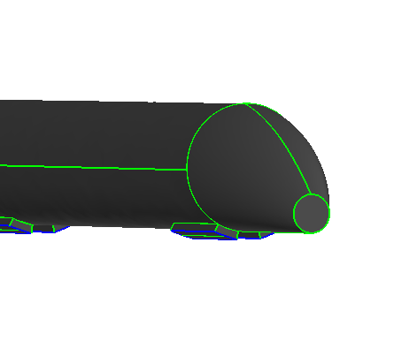
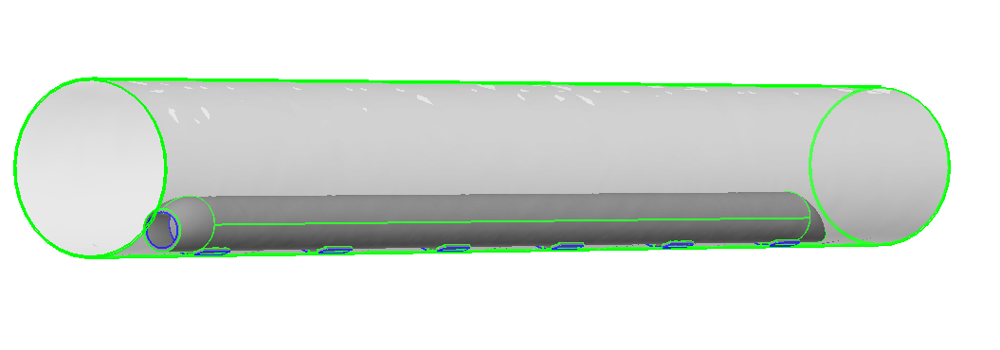

===============
Introduction
===============

The hyperloop concept is a proposed transportation system that could offer lower costs and 
travel times relative to California's current high speed rail project. The design consists 
of a passenger pod traveling in a tube under light vacuum at near sonic speeds. Propulsion 
is provided via linear accelerators mounted on the tube itself and the pod rides on a set 
of air bearings. The speed of the capsule is limited by the ability of air to escape around
the outside of the vehicle, therefore a compression system is used to draw air through the 
vehicle. Compressing the air allows the capsule to reach higher speeds and also provides 
the air bearings with the necessary pressure. Many of these different sub-systems interact 
with each other and an effective hyperloop system will need to balance multiple tradeoffs. 

We propose the the design of the hyperloop should be taken from a systems perspective with 
the dual objectives of minimizing ticket cost and minimizing travel time. In order to achieve 
this goal we propose a top down design approach where the designs of all components
are optimized simultaneously with respect to the overall system goals.

An overarching framework is needed to orchestrate the interaction between models of  
various subsystems and perform the necessary optimization. This code base contains a hyperloop 
system model built by a handful of engineers and computer scientists as an `OpenMDAO.`__
plugin. The intention is to provide this code as a baseline for further public 
contribution to support an open source hyperloop design. Interested parties should feel 
to modify the code as they see fit and improve the models in areas where they have expertise. 

.. __: http://openmdao.org/

The model is broken down into 5 major sub-systems: 

    #. **Compression System (compress)**: Performance and power consumption of the compressors
    #. **Mission Analysis (mission)**: Estimate of travel time 
    #. **Pod Geometry (pod)**: Physical Dimensions and calculations that depend on them
    #. **Tube Flow Limitations (flow_limit)**: Tube flow limitations based on choked flow restrictions
    #. **Tube Wall Temperature (tube_wall_temp)**: Equilibrium temperature of the tube wall

.. figure:: images/hyperloop_assembly_xdsm.png
   :align: center
   :alt: Hyperloop assembly connections

   The overall layout of the hyperloop assembly and the connections between the components. 

   Redesign of the inlet using OpenCSM, a parametric solid modeler.

   Redesign of the nozzle. (back of the capsule)

   Relational size between the capsule and tube for a designed capsule speed of Mach 0.8 and bypass air speed of Mach 0.95