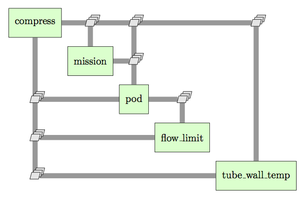
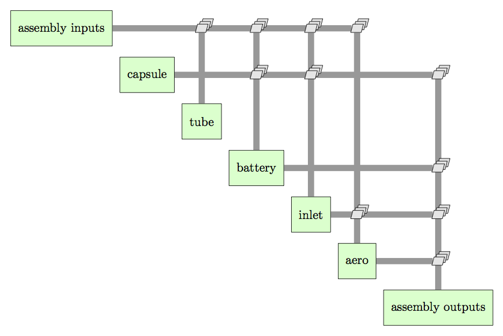

============================
Model Layout
============================

The model is broken down into 5 major sub-systems: 

    #. **Compression System (compress)**: Performance and power consumption of the compressors
    #. **Mission Analysis (mission)**: Estimate of travel time 
    #. **Pod Geometry (pod)**: Physical Dimensions and calculations that depend on them
    #. **Tube Flow Limitations (flow_limit)**: Pod speed limitations based on choked flow restrictions between the pod and the tube
    #. **Tube Wall Temperature (tube_wall_temp)**: Equilibrium temperature of the tube wall

   The overall layout of the hyperloop assembly and the connections between the components. 

The compression system and pod geometry sub-systems are further broken down into sub assemblies. 

   The expanded layout of the pod sub-assembly.

.. figure:: images/compress_assembly_xdsm.png
   :align: center
   :alt: Compress assembly XDSM diagram

   The expanded layout of the pod sub-assembly.

============================
Inputs and Outputs
============================

.. note:: 
    Before describing the I/O of the model, note that this list represents the current state 
    of the model. In its current form, this model is far from complete and as new analyses are added
    additional design variables and couplings will need to be added to this list. 

Design Variables
====================

The model has the following design variables: 

========================  ====================================================  ========  ===============  ===============  ===============
Variable                  Description                                           Units     Baseline Value        Min.             Max.
========================  ====================================================  ========  ===============  ===============  ===============
Mach_bypass               Mach number of the air traveling around the pod                   .95              .5              .98
------------------------  ----------------------------------------------------  --------  ---------------  ---------------  ---------------  
Mach_pod_max              Maximum travel Mach number of the pod                             .9               .5              .98              
------------------------  ----------------------------------------------------  --------  ---------------  ---------------  ---------------  
Mach_c1_in                Mach number of the air at the back of the inlet                   .6               .5              .8
------------------------  ----------------------------------------------------  --------  ---------------  ---------------  ---------------  
Ps_tube                   Static pressure of the air in the tube                  Pa         99                99              500
------------------------  ----------------------------------------------------  --------  ---------------  ---------------  ---------------  
c1_PR_des                 First compressor pressure ratio                                    12.47             10              25
========================  ====================================================  ========  ===============  ===============  ===============

Model Parameters
=======================
These values are free for the user to set, but are not intended for the optimizer.

========================  ===========================================================  ========  ===============  ===============  ===============
Variable                  Description                                                  Units     Baseline Value        Min.             Max.
------------------------  -----------------------------------------------------------  --------  ---------------  ---------------  ---------------  
pwr_marg                  Safety factor applied to the power requirement for the pod                .3                  0                2
------------------------  -----------------------------------------------------------  --------  ---------------  ---------------  ---------------
solar_heating_factor      Fraction of solar radiation to consider in tube temperature               .7                  0                1
------------------------  -----------------------------------------------------------  --------  ---------------  ---------------  ---------------
tube_length               Length of the tube                                             m         563270              N/A              N/A
------------------------  -----------------------------------------------------------  --------  ---------------  ---------------  ---------------
n_rows                    Number of rows of seats in the passenger capsule                           14
------------------------  -----------------------------------------------------------  --------  ---------------  ---------------  ---------------
length_row                Length alloted to each row of seats                            cm          150               120              200
------------------------  -----------------------------------------------------------  --------  ---------------  ---------------  ---------------
coef_drag                 Drag coefficient for the pod                                                2                 .6               2.5
------------------------  -----------------------------------------------------------  --------  ---------------  ---------------  ---------------
hub_to_tip                Ratio of hub radius to tip radius for the first compressor                  .4                .2               .6
========================  ===========================================================  ========  ===============  ===============  ===============

Constraints and State Variables
=================================

The hyperloop system presents a multidisciplinary design problem. The cyclic connections in
the above figure represent the coupling relationships between the different sub-systems. These 
couplings enforce a set of equality constraints that must be satisfied for any valid hyperloop 
design. For constraints 1 and 4, a multiplier has been applied to the constraint to scale it for 
improved numerical convergence. 
     
    #. ``0.01*(compress.W\_in - flow\_limit.W_excess) = 0``
    #. ``compress.Ps\_bearing\_residual = 0``
    #. ``tube\_wall\_temp.ss\_temp\_residual = 0``  
    #. ``0.01*(pod.area\_compressor\_bypass - compress.area\_c1\_out) = 0``

The model has a set of state variables that are varied to satisfy the constraints. State variables 
3 and 4 are given as a list of variables. These are lists represent linked variables. They are treated 
as a single variable for the purposes of converging the model, but remain distinct variables in the model. 

    #. ``compress.W_in``
    #. ``compress.c2_PR_des``
    #. ``(compress.Ts_tube,flow_limit.Ts_tube,tube_wall_temp.temp_boundary)``
    #. ``(flow_limit.radius_tube, pod.radius_tube_inner)``

Outputs
====================

There are a number of output values that are of interest

    #. Overall pod radius: ``pod.radius_inlet_outer``
    #. Total mass flow through the compression system: ``compress.W_in``
    #. Total power required to drive the compression system: ``compress.pwr_req``
    #. Total energy needed to power the compression system for one trip: ``mission.energy``
    #. Travel time for one trip: ``mission.time``
    #. Maximum speed: ``compress.speed_max``
    #. Equilibrium tube temperature: ``tube_wall_temp.temp``

.. note:: 
    For a more complete design process, the values of the design variables would be optimized 
    to minimize a combination of total power consumption and travel time. However, the model does
    not currently calculate some key values needed to get a useful answer. In particular, the linear 
    accelerator and vacuum pump power needs to be modeled before a
    design optimization can be attempted. 

It should be noted that you can select designs that are not realistic, particularly with respect
to ``pod.radius_inlet_outer``. There is a strong relationship between ``Mach_pod_max`` and the ``pod.radius_inlet_outer``. 
If you select a high ``Mach_pod_max`` (Above .8), you may find that the radius has shrunk below what is physically 
feasible without significant design changes. 

