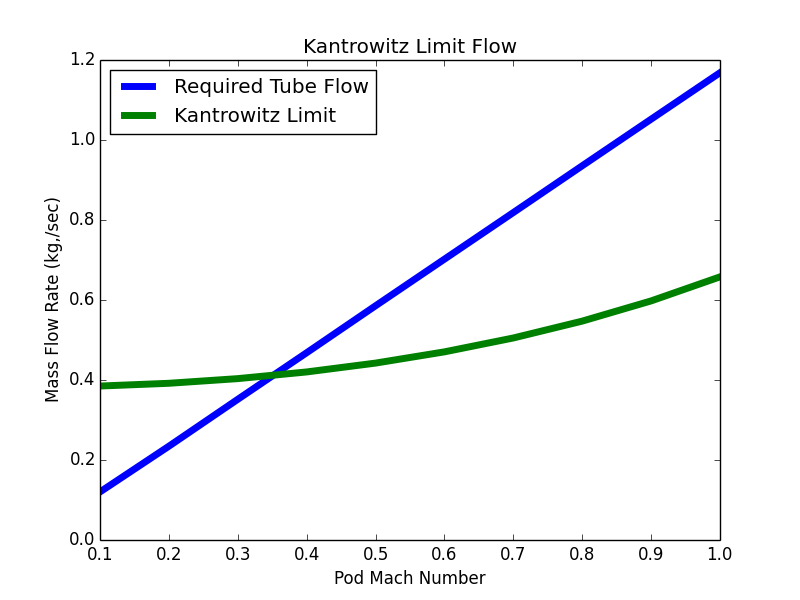

===============
Introduction
===============

This plugin provides contains the Hyperloop model built using OpenMDAO. 

===================
Modeling Summary
===================

The following sections outline the preliminary modeling work conducted by 
our team. Our main focus was to produce a model that predicts the instantaneous 
power required to run a transport capsule at the conditions specified in the 
original work. These power requirements are a function of the capsule air 
cycle and thermal conditions. The resultant power could then be combined 
with the estimated travel time to size the battery and coolant storage 
requirements. The following section provides a brief summary of the assumptions 
and modeling that went into each sub-system necessary to perform this analysis. 

For the sake of conciseness, each section serves as a general summary. 
The reader is recommended to refer to the actual source code and 
included documentation for full implementation details. The current 
model omits economic, structural, safety, and infrastructure considerations; 
areas that become more prominent once the core engineering concept is deemed 
sufficiently feasible. These aspects are equally important to the overall 
design and they represent the next required step in producing a viable hyperloop 
design concept. 

-----------------------------
Tube Airflow Requirements
-----------------------------

The hyperloop pod travels through a fixed diameter tube. As it travels, 
it must displace air around itself. The displaced air moves past the 
pod with a relative velocity equal to the travel speed of the pod and 
must fit into the area between the pod and the tube wall. If you assume 
a circular cross section for the pod, then the area for the air to 
travel through is given by 

.. math:: A_{bypass} = \pi(r_{tube}^2-r_{pod}^2)

Given the conditions in the tube, we know the density of air to be 
0.00118 :math:`\frac{kg}{m^3}`. The mass flow rate of the air 
bypassing the pod is then given by

.. math:: \dot{W}_{bypass} = \rho_{air} A_{tube} V_{pod}

Since :math:`\rho_{air}` and :math:`A_{tube}` are both constant for given tube size 
and pressure, mass flow rate grows linearly with the velocity of the pod. 

For any given flow there is a physical limitation to how the amount of 
flow you can pass through a given area. The maximum flow rate occurs when 
the velocity reaches Mach 1. For the hyperloop concept, all the air must fit 
through the area between the pod and the tube, called :math:`A_{bypass}`. When 
the air going through :math:`A_{bypass}` reaches Mach 1, no additional flow can pass through. 
This is called the Kantrowitz limit. 

.. math:: \dot{W}_{kantrowitz} = \rho_{air} A_{bypass} V_{Mach 1} 

If the required  :math:`\dot{W}_{kantrowitz}` exceeds the kantrowitz limit, then the pod will 
act like a piston in a tube and start the increase the air pressure in front 
of it and lower the pressure behind it. For the baseline hyperloop design, 
the Kantrowitz limit speed is 120 :math:`\frac{m}{s}`, or Mach .35, as shown in the 
figure below. The limit is reached when the required tube mass flow equals 
the kantrowitz limit flow. 

   The Kantrowitz limit for the baseline hyperloop concept

Such low speeds would not allow the hyperloop concept to significantly reduce 
travel times between Los Angeles and San Francisco. To reach higher speeds, 
a compression system is needed to help push additional air around the pod 
to enable higher travel speeds. The amount of air that the compression system needs 
to move is equal to the difference between the required tube flow (the blue line) 
and the Kantrowitz limit (the green line). As speed increases, the flow demands on the 
compression system increase as well. 

-----------------------------
Compression System
-----------------------------

The compression system performs two functions on the hyperloop concept. 
  #. Pressurizes some of the air, increasing its density, to provide a means of exceeding 
     the Kantrowitz limit. 
  #. Provides a source of high pressure air to the air bearing system. 

Each of these functions requires that the compressors move a certain amount of air, which 
combine to define the total airflow for the whole sub-system. The system is comprised of 
an inlet, two compressors, two heat exchangers, a nozzle, and a duct to air bearings. 

.. figure:: images/compressor_schematic.png
   :align: center
   :alt: compressor system flow diagram

   Schematic flow diagram of the compressor system

The compression systems is modeled as a 1-D cycle, representing components as a 
thermodynamic processes which are chained together. These models predict the instantaneous 
power consumption of the compression system for a given set of design variable values. The 
compression system is defined by 8 design variables, shown below. 

========================  ====================================================  ========  ===============  ===============  ===============
Variable                  Description                                           Units     Baseline Value          Min.             Max.
========================  ====================================================  ========  ===============  ===============  ===============
:math:`Mach_{pod}`        Maximum travel speed of the pod                                   1.0            .5               1.0
------------------------  ----------------------------------------------------  --------  ---------------  ---------------  ---------------  
:math:`P_{tube}`          Static pressure in the tube                           Pa          99             99                300
------------------------  ----------------------------------------------------  --------  ---------------  ---------------  ---------------  
:math:`Radius_{tube}`     Inner radius of the tube                              cm          111.5          100               200
------------------------  ----------------------------------------------------  --------  ---------------  ---------------  ---------------  
:math:`Mach_{C1 in}`      Mach number at the entrance to the first compressor               .6             .5                .8
------------------------  ----------------------------------------------------  --------  ---------------  ---------------  ---------------  
:math:`PR_{C1}`           Pressure ratio of the first compressor                            12.47          7                 20
------------------------  ----------------------------------------------------  --------  ---------------  ---------------  ---------------  
:math:`\dot{Q}_{D1}`      Heat transfer to coolant in duct 1                       kW          0              0                 300
------------------------  ----------------------------------------------------  --------  ---------------  ---------------  ---------------  
:math:`PR_{C1}`           Pressure ratio of the second compressor                           5              3                 20
------------------------  ----------------------------------------------------  --------  ---------------  ---------------  ---------------  
:math:`\dot{Q}_{D2}`      Heat transfer to coolant in duct 2                      kW          0              0                 40
========================  ====================================================  ========  ===============  ===============  ===============

For the baseline design, at a travel speed of Mach 1, the total power consumption 
from the compressors to be about 339 kW (455 horsepower). 

-----------------------------
Battery Pack
-----------------------------

-----------------------------
Tube Temperature
-----------------------------

As each pod passes through the tube, it adds energy to the air in an amount equivalent to what was 
used to power the compressors. This added energy will cause a small temperature rise in the pod. Each 
pod cause an additional slight temperature rise as it passes, which could potentially heat the overall 
hyperloop system to excessive temperatures. In the original proposal, to combat this effect, it was 
proposed that water-to-air heat exchangers could be added to the compression system. These would use 
water stored in tanks in the pod to cool the air by converting it to steam. The steam could then be 
stored in an additional tank, and offloaded once the pod reached its destination. According to our 
initial calculations, using water for cooling is not an ideal design for two reasons: 

 1) The flow rate of water needed to remove the heat added by the compressors is very large, and 
 storing the resulting steam would result in an unreasonably large pod (over 200 meters long). 

 2) The heat addition from each pod moving through the tube is fairly low, even when compared to 
 radiative solar heating of the steel tube. Even with no active cooling solution, the tube temperatures
 won’t reach excessive levels. 

In the following two sections, we explain the analyses we used to draw the above conclusions. 

Water/Steam Storage Requirements 
=================================

The effectiveness of a heat exchanger can be described as the ratio of actual heat transfer over the maximum 
possible heat transfer. This can be written mathematically as,

.. math::   {Q}_{released}  = effectiveness * {Q}_{max}

where :math:`{Q}_{max} = (T_{hot,in} - T_{cold,in})` multiplied by the lowest product of the two fluids :math:`\dot{m}_{fluid} * C_{p,fluid}`

In order to satisfy the energy balance :math:`{Q}_{released}  = {Q}_{absorbed}` , the following must be true,

.. math::      \dot{m}_{air} * C_{p, air} * (T_{out, air} - T_{in, air}) = {Q}_{released} = {Q}_{absorbed}= \dot{m}_{water} * C_{p,water} * (T_{out, water} - T_{in, water})

where the :math:`T_{out}` of each fluid is unknown. Through iteration, the :math:`T_{out}` of each fluid can be found. 
Valid effectiveness levels for heat exchangers can be determined based on the E- `NTU method.`__. 

.. __: http://en.wikipedia.org/wiki/NTU_method

The effectiveness for a counter flow heat exchanger with a Cmin/Cmax of ~0.25 was chosen

.. figure:: images/heat_effectiveness.png
   :align: center
   :alt: Heat Exchanger Effictiveness Graph
Image from http://www.cheresources.com/content/articles/heat-transfer/heat-exchanger-effectiveness

The following conditions satisfied an energy balance with the assumed effectiveness of 0.9765

============== =============== ================= ================= ================== ========= ========= 
Fluid               Cp         :math:`{T}_{in}`  :math:`{T}_{out}` :math:`\dot{m}`     Q  kJ/s   Q  max
============== =============== ================= ================= ================== ========= ========= 
Water          1.006 kJ/kg-K        791 K             300 K            0.45 kg/s        -242      247.9
-------------- --------------- ----------------- ----------------- ------------------ --------- --------- 
Air            4.186 kJ/kg-K       288.15 K          416.6 K           0.49 kg/s         242      247.9
============== =============== ================= ================= ================== ========= =========  

With a 35 minute trip, :math:`0.45 kg/s * 60 s/min * 35 min =  945 kg/s` of standard temperature/pressure water would 
need to be carried with appropriate sized steam tanks. This doesn't even account for the second stage heat exchanger, 
making the system nearly infeasible with water and unpressurized tanks. Various systems involving alternate coolants 
such as liquid air or pressurized tanks could be explored, possibly with the benefit of being combined with a rankine 
cycle to reduce system energy costs.

In spite of these results, as a basic excercise a hypothetical baseline heat exchanger model was developed to investigate 
the weight and sizing requirements of an  on-board water cooling system using the Logarithmic Mean Temperature Difference 
(LMTD) method. The exchanger was sized to remove all excess heat generated by the two compressors using a pedagogical shell 
and tube design. Based on the temperature restraints and exhaust flow rate determined by the cycle model, necessary water 
flow rates were calculated to ensure an energy balance. Given a predefined heat exchanger cross-section, fluid flow regimes 
and heat transfer coefficients were obtained. The combination of all of these elements provide a first-cut approximation of 
tank sizes, total heat exchanger volume, and pumping requirements.

Given:

-For simplicity, only a single heat exchanger is designed (to cool down the air coming off the second compressor stage)

-Sized as a classic shell and tube heat exchanger!

Method Assumptions:

-Input and output temperatures are known for each fluid

-Temperature change across the heat exchanger cannot be so large that Cp changes significantly

-Rigorously defined for double-pipe(or tubular) heat exchanger

Based on these temperatures, the Logarathmic Mean Temperature Difference (LMTD) method can be employed.

 assumption that the heat exchanger must cool the compressed air back down to the same temperature as the incoming flow, the required heat released from the system is given as:

.. math::   {Q}_{air}  = \dot{m}_{air} C_{p,air} \Delta{T}_{air}

References:

Cengal, Y., Turner, R., & Cimbala, J. (2008). Fundamentals of thermal-fluid sciences. (3rd ed.). McGraw-Hill Companies.

Turns, S. (2006). Thermal-fluid sciences: An integrated approach. Cambridge University Press.

3rd Ed. of Introduction to Heat Transfer by Incropera and DeWitt, equations (9.33) and (9.34) on page 465 <http://www.egr.msu.edu/~somerton/Nusselt/ii/ii_a/ii_a_3/ii_a_3_a.html>

Equilibrium Tube Temperature
=================================

A high-level assessment of the overall steady-state heat transfer between the 300 mile hyperloop tube and 
the ambient atmosphere was also investigated. The outer diameter of the pipe was chosen as the control 
surface boundary. Heat added from the capsule exhaust air and solar flux were considered the primary drivers 
for heat absorption into the tube. Heat released from the tube was modeled by means of ambient natural 
convection, and radiation out from the stainless-steel surface. The thermal interaction between the rarified 
internal air and tube was not modeled and assumed to reach steady-state in a reasonable period of time. These 
calculations served to approximate the necessary cooling requirements of the on-board heat exchanger given a 
certain steady-state heat limit within the tube.

References:
`Link`__.

.. __: https://github.com/jcchin/Hyperloop/blob/master/docs/Hyperloop-Alpha.md#4-hyperloop-transportation-system

https://mdao.grc.nasa.gov/publications/Berton-Thesis.pdf

-----------------------------
Geometry
-----------------------------

============================
Future Modeling RoadMap
============================

The current model of the hyperloop focuses on some of the primary sub-systems that operate within the pod. 
However, there is much more analysis that needs to be done to build a complete hyperloop design. Below provides 
a brief summary of the areas we feel represent the logical next steps for the modeling process. 

-----------------------------
System Design Optimization
-----------------------------

The current baseline appears to be a feasible design, but the design space is large (and will grow with additional 
models) and needs to be more fully explored. Overall, the goal of the hyperloop design should be to find the right 
compromise between maximum passenger throughput, minimum travel time, and minimum cost per trip. The following are 
some major open questions about the hyperloop design space: 

1) What is the relationship between overall energy usage and tube pressure? Would a slightly higher pressure lower 
the overall energy consumption by reducing vacuum pump effort more than it increases power requirements for the pod? 

2) What is the best combination of pressure ratios for the compression system? Does the bypass air need to be 
pressurized so highly? 

3) What is the best size for the tube diameter? Larger diameters will increase pump effort, but decrease pod power 
usage? Could a larger diameter coupled with a slightly higher pressure provide superior performance? 

-----------------------------
Battery and Motors 
-----------------------------

The initial estimates of battery size and weight rely on extremely simple calculations. As noted, the power requirements 
amount to roughly three batteries from a Tesla Model-S. Much better weight and size estimates for these off-the-shelf 
batteries need to be integrated. 

-----------------------------
Air Bearings
-----------------------------

The current models assume a fixed mass flow requirement for the air bearing system. A more accurate model would account 
for the overall weight of the pod, the pressure of the air, and the overall bearing size. A more detailed bearing model 
should be coupled to the compression system model to ensure a feasible design is achieved. 

-----------------------------
Vacuum Pumps
-----------------------------

-----------------------------
Solar Power Generation
-----------------------------

One of the major features of the hyperloop concept is its near net-zero energy consumption, via the inclusion of solar panels 
along the length of the tubes. Models are needed to predict, based on geographical location, weather, and time of year, how 
much power could be produced on an ongoing basis from such a solar panel system.

-----------------------------
Pod Structural Design
-----------------------------

-----------------------------
Component Mass Estimation
-----------------------------

-----------------------------
Linear Accelerators
-----------------------------

-----------------------------
Route Optimization
-----------------------------

